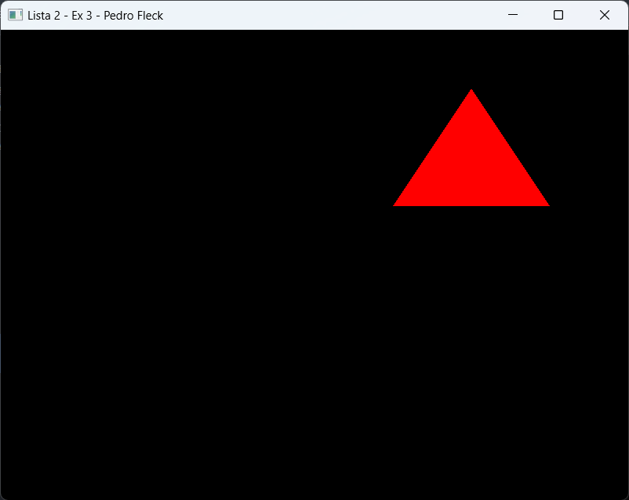
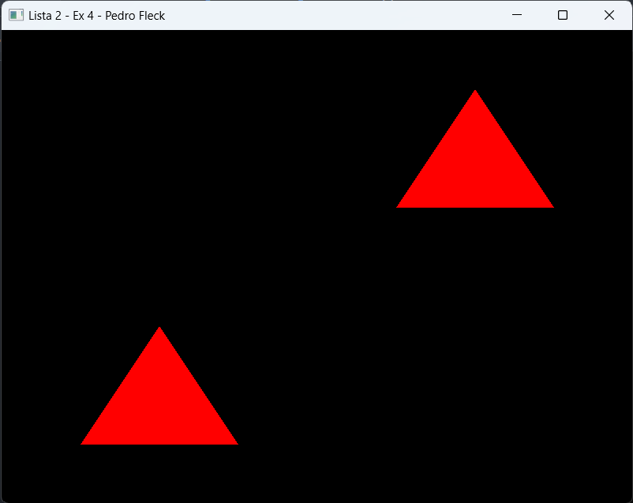

## Lista de Exercícios 2 – Processamento Gráfico

<b>1. Modifique a janela do mundo (window/ortho) para os limites: xmin=-10, xmax=10, ymin=-10, ymax=10.</b>

    projection = glm::ortho(-10.0, 10.0, -10.0, 10.0, -1.0, 1.0);

<b>2. Agora modifique para: xmin=0, xmax=800, ymin=600, ymax=0.</b>
    
    projection = glm::ortho(0.0, 800.0, 600.0, 0.0, -1.0, 1.0);

<b>3. Utilizando a câmera 2D do exercício anterior, desenhe algo na tela. O que acontece quando posicionamos os objetos? Por que é útil essa configuração?</b>

A configuração mencionada é útil para definir os limites mínimos e máximos dos eixos x e y, indicando onde a tela começa e termina. Essa configuração é frequentemente utilizada como padrão, começando a contar a partir do canto superior esquerdo.

<b>4. Modifique o viewport para desenhar a cena apenas no seguinte quadrante da janela da aplicação:</b>

<b>5. Agora, desenhe a mesma cena nos 4 quadrantes.</b>

